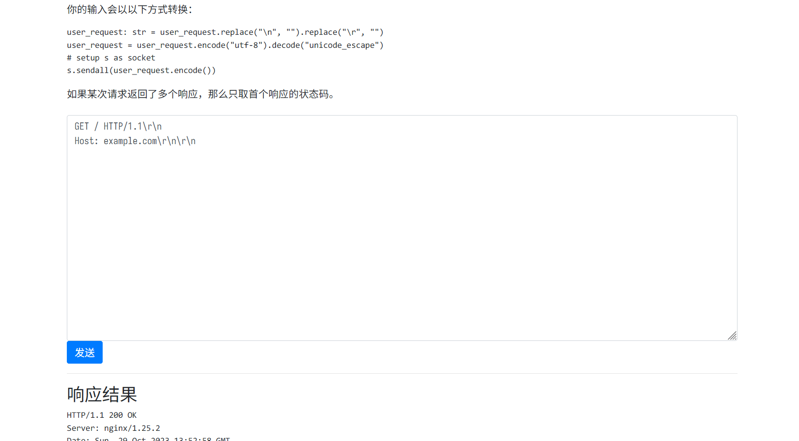

## 11. HTTP 集邮册

> 「HTTP 请求一瞬间就得到了响应，但是，HTTP 响应的 status line、header 和 body 都是确实存在的。如果将一个一个 HTTP 状态码收集起来，也许就能变成……变成……变成……」
> 
> 「flag？」
> 
> 「就能变成 flag！」

---

本题中，你可以向一个 nginx 服务器（对应的容器为**默认配置**下的 **`nginx:1.25.2-bookworm`**）发送 HTTP 请求。你需要获取到不同的 HTTP 响应状态码以获取 flag，其中：

- 获取第一个 flag 需要收集 5 种状态码；
- 获取第二个 flag 需要让 nginx 返回首行无状态码的响应（不计入收集的状态码中）；
- 获取第三个 flag 需要收集 12 种状态码。

关于无状态码的判断逻辑如下：

```python
crlf = buf.find(b"\r\n")
if buf.strip() != b"":
    try:
        if crlf == -1:
            raise ValueError("No CRLF found")
        status_line = buf[:crlf]
        http_version, status_code, reason_phrase = status_line.split(b" ", 2)
        status_code = int(status_code)
    except ValueError:
        buf += "（无状态码）".encode()
        status_code = None
```

### 题目描述

> 网址：http://202.38.93.111:11461/



一个简单的用户界面，帮助选手编写并提交请求。下方会直接显示响应结果。这免去了选手使用某些专用工具提交请求的麻烦。

界面会自动记录选手获得的状态码。

### 尝试与解决

> 关键词：HTTP 格式、MDN 文档、HTTP 发展史

我的尝试过程实在太复杂了，因此这里只按照我的收集顺序列举各个状态码的思路。这些状态码是：

```plain
[ 200, 400, 404, 505, null, 405, 206, 414, 100, 416, 304, 413, 412 ]
```

[这里](https://developer.mozilla.org/en-US/docs/Web/HTTP/Status)有所有通用 HTTP 状态代码的完整文档。

#### 200 - OK

这是最简单的，只要将默认的请求内容发送出去就能得到。

```plain
GET / HTTP/1.1\r\n
Host: example.com\r\n
\r\n
```

```plain
HTTP/1.1 200 OK
Server: nginx/1.25.2
Date: Sun, 29 Oct 2023 14:14:01 GMT
Content-Type: text/html
Content-Length: 615
Last-Modified: Tue, 15 Aug 2023 17:03:04 GMT
Connection: keep-alive
ETag: "64dbafc8-267"
Accept-Ranges: bytes

<!DOCTYPE html>
...
```

#### 400 - Bad Request

表示服务器明知客户端发送的请求不符合规范，无法处理，因而不予处理。只要对请求做一些手脚使其不符合规范就行。

```plain
GET / NMSL/1.1\r\n
Host: example.com\r\n
\r\n
```

```plain
HTTP/1.1 400 Bad Request
Server: nginx/1.25.2
...
```

#### 404 - Not Found

这是应该最常见的错误状态代码，访问一个不存在的文件就可以获得。

```plain
GET /1.txt HTTP/1.1\r\n
Host: example.com\r\n
\r\n
```

```plain
HTTP/1.1 404 Not Found
Server: nginx/1.25.2
...
```

#### 505 - HTTP Version Not Supported

刚才对 `HTTP/1.1` 的前半部分动了手脚，不妨试试对后半部分也动动手脚。

```plain
GET / HTTP/114.514\r\n
Host: example.com\r\n
\r\n
```

```plain
HTTP/1.1 505 HTTP Version Not Supported
Server: nginx/1.25.2
...
```

表示客户端使用的 HTTP 版本不受支持。

#### 无状态码

那如果干脆删掉 `HTTP/1.1` 呢？

```plain
GET /\r\n
Host: example.com\r\n
\r\n
```

```plain
<!DOCTYPE html>
<html>
...
（无状态码）
```

啊？于是第二个 flag 直接就到手了（说实话看到 flag 之前我都不知道有这个任务点）。flag 上写着：did you hear the HTTP packet from 1991? 你听到来自 1991 的 HTTP 数据包了吗？

上网搜索，得知这是 1991 发布的初代 HTTP 格式标准（史称 `HTTP/0.9`），请求只有一行，就是 `GET <文件名>`，而响应没有状态码也没有标头，只有 HTML 文件内容。后来的 `HTTP/1.0` 就添加请求标头、状态码和响应标头。为了和之前的标准做区分，在 `GET` 行末尾添加了协议版本 `HTTP/1.0`。

#### 405 - Not Allowed

我们知道现在的 HTTP 不只有 GET 一个方法。如果换一个肯定不会被接受的方法呢？比如 `DELETE`，服务器总不会允许客户端删除上面的文件吧。

```plain
DELETE / HTTP/1.1\r\n
Host: example.com\r\n
\r\n
```

```plain
HTTP/1.1 405 Not Allowed
Server: nginx/1.25.2
...
```

至此已经获得 5 个状态码，得到第一个 flag。

#### 206 - Partial Content

其实不只是 200，2xx 的代码都表示请求成功。例如，断点续传中，客户端需要通过 `Range` 标头向服务器请求文件的部分内容。此时如果服务器支持断点续传，就应该只返回这一部分内容，并且返回 206 状态码。由于 index.html 是静态文件，服务器是很可能支持断点续传的，之前服务器响应中的 `Accept-Ranges: bytes` 一行也提示了这一点。

```plain
GET / HTTP/1.1\r\n
Host: example.com\r\n
Range: bytes=0-1\r\n
\r\n
```

```plain
HTTP/1.1 206 Partial Content
Server: nginx/1.25.2
Date: Sun, 29 Oct 2023 14:17:13 GMT
Content-Type: text/html
Content-Length: 2
Last-Modified: Tue, 15 Aug 2023 17:03:04 GMT
Connection: keep-alive
ETag: "64dbafc8-267"
Content-Range: bytes 0-1/615

<!
```

#### 414 - Request-URI Too Large

如果经常搞~~野蛮的~~传统 Web 会知道，如果通过 query 参数传递大量信息，导致 query 参数过长（从而请求 URI 的总长过长），服务器难以接受，则会获得 414 状态码。这个长度限制通常为 2048~8192 bytes。因此，我们构造一个长度为 8192 的参数。

如果手打太累，可以用 Python 生成：

```plain
> python -c "print('a' * 8192)" > large_entity.txt
```

然后提交，

```plain
GET /?query=aaaaaaaaaaaaaaaaaaaaaaaaaaaaaaaaaaaaaaaaaaaaaaaaaaaaaaaaaaaaaaaaaaaaaaaaaaaaaaaaaaaaaaaaaaaaaaaaaaaaaaaaaaaaaaaaaaaaaaaaaaaaaaaaaaaaaaaaaaaaaaaaaaaaaaaaaaaaaaaaaaaaaaaaaaaaaaaaaaaaaaaaaaaaaaaaaaaaaaaaaaaaaaaaaaaaaaaaaaaaaaaaaaaaaaaaaaaaaaaaaaaaaaaaaaaaaaaaaaaaaaaaaaaaaaaaaaaaaaaaaaaaaaaaaaaaaaaaaaaaaaaaaaaaaaaaaaaaaaaaaaaaaaaaaaaaaaaaaaaaaaaaaaaaaaaaaaaaaaaaaaaaaaaaaaaaaaaaaaaaaaaaaaaaaaaaaaaaaaaaaaaaaaaaaaaaaaaaaaaaaaaaaaaaaaaaaaaaaaaaaaaaaaaaaaaaaaaaaaaaaaaaaaaaaaaaaaaaaaaaaaaaaaaaaaaaaaaaaaaaaaaaaaaaaaaaaaaaaaaaaaaaaaaaaaaaaaaaaaaaaaaaaaaaaaaaaaaaaaaaaaaaaaaaaaaaaaaaaaaaaaaaaaaaaaaaaaaaaaaaaaaaaaaaaaaaaaaaaaaaaaaaaaaaaaaaaaaaaaaaaaaaaaaaaaaaaaaaaaaaaaaaaaaaaaaaaaaaaaaaaaaaaaaaaaaaaaaaaaaaaaaaaaaaaaaaaaaaaaaaaaaaaaaaaaaaaaaaaaaaaaaaaaaaaaaaaaaaaaaaaaaaaaaaaaaaaaaaaaaaaaaaaaaaaaaaaaaaaaaaaaaaaaaaaaaaaaaaaaaaaaaaaaaaaaaaaaaaaaaaaaaaaaaaaaaaaaaaaaaaaaaaaaaaaaaaaaaaaaaaaaaaaaaaaaaaaaaaaaaaaaaaaaaaaaaaaaaaaaaaaaaaaaaaaaaaaaaaaaaaaaaaaaaaaaaaaaaaaaaaaaaaaaaaaaaaaaaaaaaaaaaaaaaaaaaaaaaaaaaaaaaaaaaaaaaaaaaaaaaaaaaaaaaaaaaaaaaaaaaaaaaaaaaaaaaaaaaaaaaaaaaaaaaaaaaaaaaaaaaaaaaaaaaaaaaaaaaaaaaaaaaaaaaaaaaaaaaaaaaaaaaaaaaaaaaaaaaaaaaaaaaaaaaaaaaaaaaaaaaaaaaaaaaaaaaaaaaaaaaaaaaaaaaaaaaaaaaaaaaaaaaaaaaaaaaaaaaaaaaaaaaaaaaaaaaaaaaaaaaaaaaaaaaaaaaaaaaaaaaaaaaaaaaaaaaaaaaaaaaaaaaaaaaaaaaaaaaaaaaaaaaaaaaaaaaaaaaaaaaaaaaaaaaaaaaaaaaaaaaaaaaaaaaaaaaaaaaaaaaaaaaaaaaaaaaaaaaaaaaaaaaaaaaaaaaaaaaaaaaaaaaaaaaaaaaaaaaaaaaaaaaaaaaaaaaaaaaaaaaaaaaaaaaaaaaaaaaaaaaaaaaaaaaaaaaaaaaaaaaaaaaaaaaaaaaaaaaaaaaaaaaaaaaaaaaaaaaaaaaaaaaaaaaaaaaaaaaaaaaaaaaaaaaaaaaaaaaaaaaaaaaaaaaaaaaaaaaaaaaaaaaaaaaaaaaaaaaaaaaaaaaaaaaaaaaaaaaaaaaaaaaaaaaaaaaaaaaaaaaaaaaaaaaaaaaaaaaaaaaaaaaaaaaaaaaaaaaaaaaaaaaaaaaaaaaaaaaaaaaaaaaaaaaaaaaaaaaaaaaaaaaaaaaaaaaaaaaaaaaaaaaaaaaaaaaaaaaaaaaaaaaaaaaaaaaaaaaaaaaaaaaaaaaaaaaaaaaaaaaaaaaaaaaaaaaaaaaaaaaaaaaaaaaaaaaaaaaaaaaaaaaaaaaaaaaaaaaaaaaaaaaaaaaaaaaaaaaaaaaaaaaaaaaaaaaaaaaaaaaaaaaaaaaaaaaaaaaaaaaaaaaaaaaaaaaaaaaaaaaaaaaaaaaaaaaaaaaaaaaaaaaaaaaaaaaaaaaaaaaaaaaaaaaaaaaaaaaaaaaaaaaaaaaaaaaaaaaaaaaaaaaaaaaaaaaaaaaaaaaaaaaaaaaaaaaaaaaaaaaaaaaaaaaaaaaaaaaaaaaaaaaaaaaaaaaaaaaaaaaaaaaaaaaaaaaaaaaaaaaaaaaaaaaaaaaaaaaaaaaaaaaaaaaaaaaaaaaaaaaaaaaaaaaaaaaaaaaaaaaaaaaaaaaaaaaaaaaaaaaaaaaaaaaaaaaaaaaaaaaaaaaaaaaaaaaaaaaaaaaaaaaaaaaaaaaaaaaaaaaaaaaaaaaaaaaaaaaaaaaaaaaaaaaaaaaaaaaaaaaaaaaaaaaaaaaaaaaaaaaaaaaaaaaaaaaaaaaaaaaaaaaaaaaaaaaaaaaaaaaaaaaaaaaaaaaaaaaaaaaaaaaaaaaaaaaaaaaaaaaaaaaaaaaaaaaaaaaaaaaaaaaaaaaaaaaaaaaaaaaaaaaaaaaaaaaaaaaaaaaaaaaaaaaaaaaaaaaaaaaaaaaaaaaaaaaaaaaaaaaaaaaaaaaaaaaaaaaaaaaaaaaaaaaaaaaaaaaaaaaaaaaaaaaaaaaaaaaaaaaaaaaaaaaaaaaaaaaaaaaaaaaaaaaaaaaaaaaaaaaaaaaaaaaaaaaaaaaaaaaaaaaaaaaaaaaaaaaaaaaaaaaaaaaaaaaaaaaaaaaaaaaaaaaaaaaaaaaaaaaaaaaaaaaaaaaaaaaaaaaaaaaaaaaaaaaaaaaaaaaaaaaaaaaaaaaaaaaaaaaaaaaaaaaaaaaaaaaaaaaaaaaaaaaaaaaaaaaaaaaaaaaaaaaaaaaaaaaaaaaaaaaaaaaaaaaaaaaaaaaaaaaaaaaaaaaaaaaaaaaaaaaaaaaaaaaaaaaaaaaaaaaaaaaaaaaaaaaaaaaaaaaaaaaaaaaaaaaaaaaaaaaaaaaaaaaaaaaaaaaaaaaaaaaaaaaaaaaaaaaaaaaaaaaaaaaaaaaaaaaaaaaaaaaaaaaaaaaaaaaaaaaaaaaaaaaaaaaaaaaaaaaaaaaaaaaaaaaaaaaaaaaaaaaaaaaaaaaaaaaaaaaaaaaaaaaaaaaaaaaaaaaaaaaaaaaaaaaaaaaaaaaaaaaaaaaaaaaaaaaaaaaaaaaaaaaaaaaaaaaaaaaaaaaaaaaaaaaaaaaaaaaaaaaaaaaaaaaaaaaaaaaaaaaaaaaaaaaaaaaaaaaaaaaaaaaaaaaaaaaaaaaaaaaaaaaaaaaaaaaaaaaaaaaaaaaaaaaaaaaaaaaaaaaaaaaaaaaaaaaaaaaaaaaaaaaaaaaaaaaaaaaaaaaaaaaaaaaaaaaaaaaaaaaaaaaaaaaaaaaaaaaaaaaaaaaaaaaaaaaaaaaaaaaaaaaaaaaaaaaaaaaaaaaaaaaaaaaaaaaaaaaaaaaaaaaaaaaaaaaaaaaaaaaaaaaaaaaaaaaaaaaaaaaaaaaaaaaaaaaaaaaaaaaaaaaaaaaaaaaaaaaaaaaaaaaaaaaaaaaaaaaaaaaaaaaaaaaaaaaaaaaaaaaaaaaaaaaaaaaaaaaaaaaaaaaaaaaaaaaaaaaaaaaaaaaaaaaaaaaaaaaaaaaaaaaaaaaaaaaaaaaaaaaaaaaaaaaaaaaaaaaaaaaaaaaaaaaaaaaaaaaaaaaaaaaaaaaaaaaaaaaaaaaaaaaaaaaaaaaaaaaaaaaaaaaaaaaaaaaaaaaaaaaaaaaaaaaaaaaaaaaaaaaaaaaaaaaaaaaaaaaaaaaaaaaaaaaaaaaaaaaaaaaaaaaaaaaaaaaaaaaaaaaaaaaaaaaaaaaaaaaaaaaaaaaaaaaaaaaaaaaaaaaaaaaaaaaaaaaaaaaaaaaaaaaaaaaaaaaaaaaaaaaaaaaaaaaaaaaaaaaaaaaaaaaaaaaaaaaaaaaaaaaaaaaaaaaaaaaaaaaaaaaaaaaaaaaaaaaaaaaaaaaaaaaaaaaaaaaaaaaaaaaaaaaaaaaaaaaaaaaaaaaaaaaaaaaaaaaaaaaaaaaaaaaaaaaaaaaaaaaaaaaaaaaaaaaaaaaaaaaaaaaaaaaaaaaaaaaaaaaaaaaaaaaaaaaaaaaaaaaaaaaaaaaaaaaaaaaaaaaaaaaaaaaaaaaaaaaaaaaaaaaaaaaaaaaaaaaaaaaaaaaaaaaaaaaaaaaaaaaaaaaaaaaaaaaaaaaaaaaaaaaaaaaaaaaaaaaaaaaaaaaaaaaaaaaaaaaaaaaaaaaaaaaaaaaaaaaaaaaaaaaaaaaaaaaaaaaaaaaaaaaaaaaaaaaaaaaaaaaaaaaaaaaaaaaaaaaaaaaaaaaaaaaaaaaaaaaaaaaaaaaaaaaaaaaaaaaaaaaaaaaaaaaaaaaaaaaaaaaaaaaaaaaaaaaaaaaaaaaaaaaaaaaaaaaaaaaaaaaaaaaaaaaaaaaaaaaaaaaaaaaaaaaaaaaaaaaaaaaaaaaaaaaaaaaaaaaaaaaaaaaaaaaaaaaaaaaaaaaaaaaaaaaaaaaaaaaaaaaaaaaaaaaaaaaaaaaaaaaaaaaaaaaaaaaaaaaaaaaaaaaaaaaaaaaaaaaaaaaaaaaaaaaaaaaaaaaaaaaaaaaaaaaaaaaaaaaaaaaaaaaaaaaaaaaaaaaaaaaaaaaaaaaaaaaaaaaaaaaaaaaaaaaaaaaaaaaaaaaaaaaaaaaaaaaaaaaaaaaaaaaaaaaaaaaaaaaaaaaaaaaaaaaaaaaaaaaaaaaaaaaaaaaaaaaaaaaaaaaaaaaaaaaaaaaaaaaaaaaaaaaaaaaaaaaaaaaaaaaaaaaaaaaaaaaaaaaaaaaaaaaaaaaaaaaaaaaaaaaaaaaaaaaaaaaaaaaaaaaaaaaaaaaaaaaaaaaaaaaaaaaaaaaaaaaaaaaaaaaaaaaaaaaaaaaaaaaaaaaaaaaaaaaaaaaaaaaaaaaaaaaaaaaaaaaaaaaaaaaaaaaaaaaaaaaaaaaaaaaaaaaaaaaaaaaaaaaaaaaaaaaaaaaaaaaaaaaaaaaaaaaaaaaaaaaaaaaaaaaaaaaaaaaaaaaaaaaaaaaaaaaaaaaaaaaaaaaaaaaaaaaaaaaaaaaaaaaaaaaaaaaaaaaaaaaaaaaaaaaaaaaaaaaaaaaaaaaaaaaaaaaaaaaaaaaaaaaaaaaaaaaaaaaaaaaaaaaaaaaaaaaaaaaaaaaaaaaaaaaaaaaaaaaaaaaaaaaaaaaaaaaaaaaaaaaaaaaaaaaaaaaaaaaaaaaaaaaaaaaaaaaaaaaaaaaaaaaaaaaaaaaaaaaaaaaaaaaaaaaaaaaaaaaaaaaaaaaaaaaaaaaaaaaaaaaaaaaaaaaaaaaaaaaaaaaaaaaaaaaaaaaaaaaaaaaaaaaaaaaaaaaaaaaaaaaaaaaaaaaaaaaaaaaaaaaaaaaaaaaaaaaaaaaaaaaaaaaaaaaaaaaaaaaaaaaaaaaaaaaaaaaaaaaaaaaaaaaaaaaaaaaaaaaaaaaaaaaaaaaaaaaaaaaaaaaaaaaaaaaaaaaaaaaaaaaaaaaaaaaaaaaaaaaaaaaaaaaaaaaaaaaaaaaaaaaaaaaaaaaaaaaaaaaaaaaaaaaaaaaaaaaaaaaaaaaaaaaaaaaaaaaaaaaaaaaaaaaaaaaaaaaaaaaaaaaaaaaaaaaaaaaaaaaaaaaaaaaaaaaaaaaaaaaaaaaaaaaaaaaaaaaaaaaaaaaaaaaaaaaaaaaaaaaaaaaaaaaaaaaaaaaaaaaaaaaaaaaaaaaaaaaaaaaaaaaaaaaaaaaaaaaaaaaaaaaaaaaaaaaaaaaaaaaaaaaaaaaaaaaaaaaaaaaaaaaaaaaaaaaaaaaaaaaaaaaaaaaaaaaaaaaaaaaaaaaaaaaaaaaaaaaaaaaaaaaaaaaaaaaaaaaaaaaaaaaaaaaaaaaaaaaaaaaaaaaaaaaaaaaaaaaaaaaaaaaaaaaaaaaaaaaaaaaaaaaaaaaaaaaaaaaaaaaaaaaaaaaaaaaaaaaaaaaaaaaaaaaaaaaaaaaaaaaaaaaaaaaaaaaaaaaaaaaaaaaaaaaaaaaaaaaaaaaaaaaaaaaaaaaaaaaaaaaaaaaaaaaaaaaaaaaaaaaaaaaaaaaaaaaaaaaaaaaaaaaaaaaaaaaaaaaaaaaaaaaaaaaaaaaaaaaaaaaaaaaaaaaaaaaaaaaaaaaaaaaaaaaaaaaaaaaaaaaaaaaaaaaaaaaaaaaaaaaaaaaaaaaaaaaaaaaaaaaaaaaaaaaaaaaaaaaaaaaaaaaaaaaaaaaaaaaaaaaaaaaaaaaaaaaaaaaaaaaaaaaaaaaaaaaaaaaaaaaaaaaaaaaaaaaaaaaaaaaaaaaaaaaaaaaaaaaaaaaaaaaaaaaaaaaaaaaaaaaaaaaaaaaaaaaaaaaaaaaaaaaaaaaaaaaaaaaaaaaaaaaaaaaaaaaaaaaaaaaaaaaaaaaaaaaaaaaaaaaaaaaaaaaaaaaaaaaaaaaaaaaaaaaaaaaaaaaaaaaaaaaaaaaaaaaaaaaaaaaaaaaaaaaaaaaaaaaaaaaaaaaaaaaaaaaaaaaaaaaaaaaaaaaaaaaaaaaaaaaaaaaaaaaaaaaaaaaaaaaaaaaaaaaaaaaaaaaaaaaaaaaaaaaaaaaaaaaaaaaaaaaaaaaaaaaaaaaaaaaaaaaaaaaaaaaaaaaaaaaaaaaaaaaaaaaaaaaaaaaaaaaaaaaaaaaaaaaaaaaaaaaaaaaaaaaaaaaaaaaaaaaaaaaaaaaaaaaaaaaaaaaaaaaaaaaaaaaaaaaaaaaaaaaaaaaaaaaaaaaaaaaaaaaaaaaaaaaaaaaaaaaaaaaaaaaaaaaaaaaaaaaaaaaaaaaaaaaaaaaaaaaaaaaaaaaaaaaaaaaaaaaaaaaaaaaaaaaaaaaaaaaaaaaaaaaaaaaaaaaaaaaaaaaaaaaaaaaaaaaaaaaaaaaaaaaaaaaaaaaaaaaaaaaaaaaaaaaaaaaaaaaaaaaaaaaaaaaaaaaaaaaaaaaaaaaaaaaaaaaaaaaaaaaaaaaaaaaaaaaaaaaaaaaaaaaaaaaaaaaaaaaaaaaaaaaaaaaaaaaaaaaaaaaaaaaaaaaaaaaaaaaaaaaaaaaaaaaaaaaaaaaaaaaaaaaaaaaaaaaaaaaaaaaaaaaaaaaaaaaaaaaaaaaaaaaaaaaaaaaaaaaaaaaaaaaaaaaaaaaaaaaaaaaaaaaaaaaaaaaaaaaaaaaaaaaaaaaaaaaaaaaaaaaaaaaaaaaaaaaaaaaaaaaaaaaaaaaaaaaaaaaaaaaaaaaaaaaaaaaaaaaaaaaaaaaaaaaaaaaaaaaaaaaaaaaaaaaaaaaaaaaaaaaaaaaaaaaaaaaaaaaaaaaaaaaaaaaaaaaaaaaaaaaaaaaaaaaaaaaaaaaaaaaaaaaaaaaaaaaaaaaaaaaaaaaaaaaaaaaaaaaaaaaaaaaaaaaaaaaaaaaaaaaaaaaaaaaaaaaaaaaaaaaaaaaaaaaaaaaaaaaaaaaaaaaaaaaaaaaaaaaaaaaaaaaaaaaaaaaaaaaaaaaaaaaaaaaaaaaaaaaaaaaaaaaaaaaaaaaaaaaaaaaaaaaaaaaaaaaaaaaaaaaaaaaaaaaaaaaaaaaaaaaaaaaaaaaaaaaaaaaaaaaaaaaaaaaaaaaaaaaaaaaaaaaaaaaaaaaaaaaaaaaaaaaaaaaaaaaaaaaaaaaaaaaaaaaaaaaaaaaaaaaaaaaaaaaaaaaaaaaaaaaaaaaaaaaaaaaaaaaaaaaaaaaaaaaaaaaaaaaaaaaaaaaaaaaaaaaaaaaaaaaaaaaaaaaaaaaaaaaaaaaaaaaaaaaaaaaaaaaaaaaaaaaaaaaaaaaaaaaaaaaaaaaaaaaaaaaaaaaaaaaaaaaaaaaaaaaaaaaaaaaaaaaaaaaaaaaaaaaaaaaaaaaaaaaaaaaaaaaaaaaaaaaaaaaaaaaaaaaaaaaaaaaaaaaaaaaaaaaaaaaaaaaaaaaaaaaaaaaaaaaaaaaaaaaaaaaaaaaaaaaaaaaaaaaaaaaaaaaaaaaaaaaaaaaaaaaaaaaaaaaaaaaaaaaaaaaaaaaaaaaaaaaaaaaaaaaaaaaaaaaaaaaaaaaaaaaaaaaaaaaaaaaaaaaaaaaaaaaaaaaaaaaaaaaaaaaaaaaaaaaaaaaaaaaaaaaaaaaaaaaaaaaaaaaaaaaaaaaaaaaaaaaaaaaaaaaa HTTP/1.1\r\n
Host: example.com\r\n
\r\n
```

```plain
HTTP/1.1 414 Request-URI Too Large
Server: nginx/1.25.2
...
<head><title>414 Request-URI Too Large</title></head>
...
（连接被重置，已断开）
```

现在我们已经收集了 7 个常见或不常见的状态码了，没活了。要不去 [MDN Web Docs](https://developer.mozilla.org/en-US/docs/Web/HTTP/Status) 找找灵感？

#### [100 - Continue](https://developer.mozilla.org/en-US/docs/Web/HTTP/Status/100)

映入眼帘的第一个状态码就是 100 Continue。这个状态码表示服务器已经收到部分请求，觉得不错，让客户端继续发送请求。只有客户端发送 `Expect: 100-continue` 时才会收到这样的响应。

```plain
GET / HTTP/1.1\r\n
Host: example.com\r\n
Expect: 100-continue\r\n
\r\n
```

```plain
HTTP/1.1 100 Continue

HTTP/1.1 200 OK
...
```

#### [416 - Range Not Satisfiable](https://developer.mozilla.org/en-US/docs/Web/HTTP/Status/416)

表示通过 `Range` 标头（参见 206 Partial Content）请求的区间无法满足，情况包括 `Range` 越界导致无法返回任何内容或者 `Range` 是零长度或负长度区间。

```plain
GET / HTTP/1.1\r\n
Host: example.com\r\n
Range: bytes=114514-1919810\r\n
\r\n
```

```plain
HTTP/1.1 416 Requested Range Not Satisfiable
Server: nginx/1.25.2
...
```

#### [304 - Not Modified](https://developer.mozilla.org/en-US/docs/Web/HTTP/Status/304)

3xx 的状态码一般表示重定向。由于默认情况下 nginx 并没有任何重定向或者 URL 规范化机制，因此无法触发重定向。但是，304 是用于缓存机制的。根据文档表述，客户端可以使用 `If-None-Match` 或 `If-Modified-Since` 来指定自己缓存的文件的 ETag 或修改时间。如果与服务端情况匹配，服务器将直接返回不带内容的 304 响应告诉客户端继续使用缓存的文件；如果不匹配，服务器将响应 2xx 并发送文件内容。

服务器给出的 `index.html` 信息是：

```plain
Last-Modified: Tue, 15 Aug 2023 17:03:04 GMT
ETag: "64dbafc8-267"
```

请求 1：

```plain
GET / HTTP/1.1\r\n
Host: example.com\r\n
If-Modified-Since: Tue, 15 Aug 2023 17:03:04 GMT\r\n
\r\n
```

请求 2：

```plain
GET / HTTP/1.1\r\n
Host: example.com\r\n
If-None-Match: "64dbafc8-267"\r\n
\r\n
```

响应：

```plain
HTTP/1.1 304 Not Modified
Server: nginx/1.25.2
...
```

事实证明，请求 1 中，`If-Modified-Since` 必须和文档的修改日期一致才能触发 304，如果指定未来的日期并不能做到。这和 nginx 的具体实现有关，其效果也是合理的。

#### [413 - Request Entity Too Large](https://developer.mozilla.org/en-US/docs/Web/HTTP/Status/413)

表示客户端发送的请求**内容**部分过大。GET 一般是不携带内容的，故尝试发送 POST 请求。

```plain
POST / HTTP/1.1\r\n
Host: example.com\r\n
Content-Length: 3\r\n
\r\n
abc
```

```plain
HTTP/1.1 405 Not Allowed
Server: nginx/1.25.2
...
```

然而服务器不接受 POST 请求。要不试试发个带 `Content-Length` 的 GET 但是不发内容？

```plain
GET / HTTP/1.1\r\n
Host: example.com\r\n
Content-Length: 3\r\n
\r\n
```

这是可以的！试试把 `Content-Length` 改成很大的数。

```plain
GET / HTTP/1.1\r\n
Host: example.com\r\n
Content-Length: 20190816170251\r\n
\r\n
```

```plain
HTTP/1.1 413 Request Entity Too Large
Server: nginx/1.25.2
...
```

#### [412 - Precondition Failed](https://developer.mozilla.org/en-US/docs/Web/HTTP/Status/412)

文档指出，这种情况发生在非 `GET`/`HEAD` 请求中 `If-Unmodified-Since` 或 `If-None-Match` 条件无法满足的情况。看起来这是不可做到的，因为服务器不接受除 `GET`/`HEAD` 外的请求类型。

然而，文档正文部分则指出，`If-Match` 指定的条件不匹配，也可以触发这一状态码。

```plain
GET / HTTP/1.1\r\n
Host: example.com\r\n
If-Match: "nmsl"\r\n
\r\n
```

```plain
HTTP/1.1 412 Precondition Failed
Server: nginx/1.25.2
...
```

#### 其他状态代码不行的原因

相比于根据思路写请求，筛选可行的状态码的过程其实更花时间。这个状态码列表不是一次找出来的，而是经过多次反复调整和多次精读文档才尝试出来的。这里，我将我认为其他状态代码不可行的原因列出。

|状态码|含义|原因|
|-|-|-|
|101|协议升级|nginx 默认配置不支持 WebSocket，无法升级连接|
|102|正在处理|一般只在 WebDAV 中使用|
|201|已创建|必须是 PUT 请求|
|202|已接受|一般只在 WebDAV 中使用|
|204|无内容|默认配置的 nginx 不存在无内容页面|
|300|多选项响应|一般只在 WebDAV 中使用|
|301,302|地址重定向|默认配置不会重定向|
|303|参见| - |
|307,308|请求重定向|同上|
|401,403|拒绝访问|默认配置没有需要授权访问的页面，且所有目录都有 index|
|408|请求超时|无法通过题目所给的界面模拟|
|409|冲突|必须是 PATCH 等特殊请求|
|411|需要 Content-Length|GET 请求内容会被忽略，无法触发|
|415|不支持的内容编码|GET 请求内容会被忽略，无法触发|
|421|误导向请求|必须配置为反向代理才能获得|
|429|请求太频繁|默认配置没有 Rate limiting 设置|
|500|服务器内部错误| - |
|501|未实现| - |
|502,504|网关错误|必须配置为反向代理才能获得|
|503|服务不可用|正常情况不会出现|
|507|存储空间不足|总不能攻击服务器把存储空间填满吧|

其他文档中有记载的状态码根本不存在于 nginx 源代码中。

### Flags

```plain
flag{stacking_up_http_status_codes_is_fun_94f89eb89f}
```

Stacking up http status codes is fun! 收集状态码真好玩！

```plain
flag{d1d you hear the HTTP packet from 1991?}
```

Did you hear the HTTP packet from 1991?

```plain
flag{I think that when many such status codes are accumulated 9b9187ecdc it becomes a lifetime}
```

I think that when many such status codes are accumulated it becomes a lifetime. 我以为收集到这么多状态码时已经是一辈子了。我当时也是这么想的。
