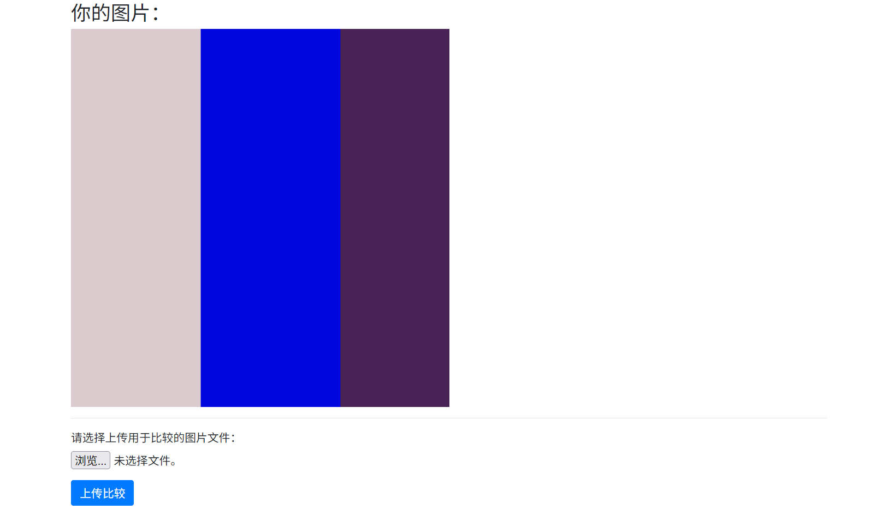
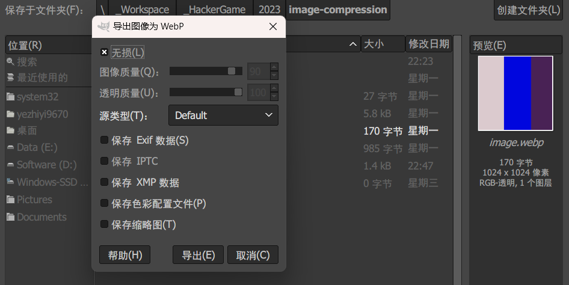

## 17. 🪐 低带宽星球

茫茫星系间，文明被分为不同的等级。每一个文明中都蕴藏了一种古老的力量 —— flag，被认为是其智慧的象征。

你在探索的过程中意外进入了一个封闭空间。这是一个由神秘的低带宽星人控制着的星球。星球的中心竖立着一个巨大的三角形任务牌，上面刻着密文和挑战。

低带宽星人的通信速度很低，只能以 1 字节 / 天的速度接受信息，所以在这个星球上，你需要将一张图片用很少的字节数传输给低带宽星人，然后获得 flag。具体来说你需要将一张图片无损压缩（每个像素的颜色都一致）：

- 压缩至 2KiB (2048 字节) 及以下，获得 flag1；
- 压缩至 50 字节及以下，获得 flag2。

[题目后端环境下载（Dockerfile 与脚本）](./image-compressor-backend.zip)

### 题目描述

> 网址：http://202.38.93.111:10060/



选手需要上传压缩后的图片取得 flag。

据说每个人的图片是不一样的，但是都是这样的三个彩色条，分辨率为 1024x1024。

### 尝试与解决

> 关键词：图像格式、图像压缩

使用常规的压缩工具进行 PNG、JPEG 无损等压缩，得到的文件甚至常常比原文件大。不妨试试大名鼎鼎的高效率格式——WebP。使用 GIMP 打开图像导出为无损 WebP，



170MB！这就拿到了 flag1。

至于 flag2，感觉需要以二极管思维和二进制数据亲密贴贴。我试图看了一下 PNG 和 WebP 的编码标准，然后放弃了。

### Flag

```plain
flag{justfind_an_image_compressor_andgo!}
```

Just find an image compressor and go!
