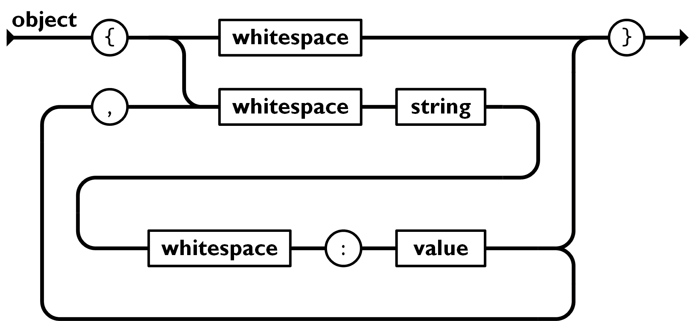

## 9. JSON ⊂ YAML?

你知道吗？Hackergame 出题时，每道题都需要出题人用 YAML 格式写下题目的关键信息。然而，每年总有一些出题人在编写 YAML 文件时被复杂的语法规则弄得头疼不已。

这天小 Z 又找到小 W 说：「我昨天写 YAML 时，又花了半天研究 YAML 的规范，YAML 好难啊！」

小 W 惊讶道：「怎么会有人不会写 YAML 呢？只要你会写 JSON 就会写 YAML 呀，因为任何合法的 JSON 本身就是合法的 YAML。」

小 Z 听闻这番言论后当场表示怀疑，立刻说出了一个字符串，JSON 和 YAML 解析出的含义存在差异。小 W 研究了一番才发现，这是因为很多主流的 YAML 库仍然是 YAML 1.1 的，它没有这个性质。他不得不承认：「好吧，这个性质只适用于 YAML 1.2。」

小 Z 笑了：「别提 YAML 1.2 了，它遇到合法的 JSON 都有可能报错。」

[下载题目源代码](./yaml_vs_json.py)

你可以通过 `nc 202.38.93.111 10096` 来连接，或者点击下面的「打开/下载题目」按钮通过网页终端与远程交互。

### 题目描述

> 终端：http://202.38.93.111:10097/

终端要求选手输入一段 JSON 并以换行符结束。之后，会判断解析情况并输出 flag。具体见“题目源代码”。

省流：

1. 第一个 flag：构造一个合法的 JSON，使得 YAML 1.1 解析报错，或者结果与 JSON 解析出的不同。
2. 第二个 flag：构造一个合法的 JSON，但是 YAML 1.2 解析报错。

### 尝试与解决

> 关键词：规范文档、测试工程师、奇技淫巧

我们不妨搜索找出 YAML 和 JSON 的规范文档来了解相关内容。

- [JSON](https://www.json.org/json-en.html)
- [YAML 1.1](https://yaml.org/spec/1.1/)
- [YAML 1.2](https://yaml.org/spec/1.2.2/)

这里 YAML 的文档是按照规范的代码结构文档形式写的，比较晦涩难读，且需要消耗大量时间。但是 JSON 的文档则不然。JSON 文档直接用几张简洁明了的状态图表示，比如这个：



但先不急着开始尝试！JSON 是 YAML 的子集，这是许多人很自然会有的误区，网上很可能就会有警示！不妨网络搜索“is json subset of yaml”，不难得到这个答案：

|原始|JSON 解析|YAML 1.1 解析|YAML 1.2 解析|
|-|-|-|-|
|`{"a":1e2}`|`{a:100}`|`{a:"1e2"}`|`{a:100}`|

（也可以直接简化为 `1e2`，效果相同）

于是第一个 flag 就有了。

对于第二个 flag，同样上网搜索。但是，我们得到了一个坏消息——YAML 1.2 本来就是朝着兼容 JSON 的方向设计的。将 JSON 文档提到的各种结构都喂给 YAML 1.2 解析，果不其然，没有出现任何报错。看来，“正常的”JSON 并不能使 YAML 1.2 报错，必须是“如正常”的才行。

有什么“如正常”的 JSON 呢？我们注意到，YAML 不允许出现游离的 Tab 字符，因为 YAML 的语法依赖于缩进，但是 JSON 却允许。不妨构造一个含 Tab 缩进的 JSON，例如 `[\t1]`（`\t` 表示 Tab 字符）。

很意外的是，这是没用的！尽管 Python 程序在 YAML 1.1 的解析中使用了 `safe_loads`，但是包含 Tab 字符的字符串还是会导致其出错。

|原始|JSON 解析|YAML 1.1 解析|YAML 1.2 解析|
|-|-|-|-|
|`[	1]`|`[1]`|ERROR even in `safe_loads`|unknown|

那么，**还**有什么“如正常”的 JSON 呢？作为 JavaScript 中衍生出的特性，JSON 是允许对象中的键名重复的，并且后面的会覆盖前面的（这一特性配合对象展开式，会大大简化 JavaScript 中一些对象复制操作的写法）。例如，`{"a":1,"a":2}` 会解析为 `{a:2}`。这一特性在一些信息安全攻击中也有利用。

但是，YAML 作为用来编写配置文件的语言，很可能不允许这种模棱两可的行为，从而报错。确实！

|原始|JSON 解析|YAML 1.1 解析|YAML 1.2 解析|
|-|-|-|-|
|`{"a":1,"a":2}`|`{a:2}`|`{a:2}`|ERROR|

第二个 flag 也有了。

如果你执着于“一石二鸟”，不妨试试提交 `{"a":1,"a":1e2}`。

### Flag

```plain
flag{faf9facd7c9d64f74a4a746468400a50fa619badd1}
```

```plain
flag{b1c73f14d04db546b7e7e24cf1cc7252b29d23d68b}
```

### 其他做法

#### 测试工程师式尝试

带着测试工程师式的执着，枚举 JSON 中各种合法的结构，花一定时间也可以拿下第一个 flag。
