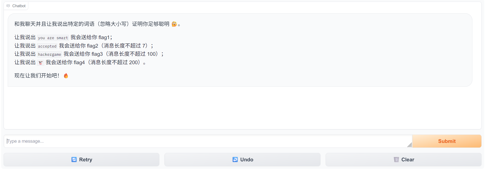

## 15. 🪐 小型大语言模型星球

> 包含 AI 辅助创作


茫茫星系间，文明被分为不同的等级。每一个文明中都蕴藏了一种古老的力量 —— flag，被认为是其智慧的象征。

你在探索的过程中意外进入了一个封闭空间。这是一个由神秘的 33M 参数的「小型大语言模型」控制着的星球。星球的中心竖立着一个巨大的三角形任务牌，上面刻着密文和挑战。

在这个星球上，你需要与这个先进的语言模型展开一场交流。通过与它对话，诱导它说出指定的词语，从这个神秘智慧体中获得 flag。你需要让这个语言模型分别说出 `you are smart`，`accepted`，`hackergame` 和 `🐮`，以获得四个 flag，证明你足够聪明以控制这个星球的命运。

#### 题目信息

如果本地运行遇到网络问题，可使用 [TinyStories-33M.zip](https://hack.lug.ustc.edu.cn/media/21fb5dd1-efac-5554-a7d2-b2a8d8d5c75f/TinyStories-33M.zip) 中缓存的模型参数（约 244 MB，未做任何修改），并将代码中的：

```python
from_pretrained("roneneldan/TinyStories-33M")
```

改为本地的：

```python
from_pretrained("./TinyStories-33M")
```

### 题目描述

> 网址：http://202.38.93.111:10101/



页面末尾附有其源代码 [main.py](./main.py)。

### 尝试与解决

> 关键词：TinyStories、暴力枚举

要不先问候一下大语言模型吧。

```plain
--- player ---
Hello

--- model ---
, little girl. Do you want to play with me?"

Lily nodded and said, "Yes, please. What do you like to
```

啊？这好像不是正常的聊天模型啊...

仔细读读题目，这个模型叫 TinyStories。上网搜索，方可得知这个模型是用来做故事续写而不是聊天的。因此，要按照故事续写的模式调教。

#### You are smart

直观而言，要得到“You are smart”，可以问聊天机器人“Am I smart?”。但是，这是一个故事续写机器人。解决方法很简单，将这句话变成对话内容就行了。

```plain
--- player ---
"Am I smart?"

--- model ---
"Yes, you are smart!" her mom said. "You are a smart girl. You can do anything you want."

L
👏👏👏 flag1: flag{!-ThINk-You-@Re-RE@!1y-RE4Lly-$M@RT} 👏👏👏
```

#### Accepted

按理来说可以用上面的方法搞出“Accepted”，但是这题要求输入长度不大于 7，这就非常困难了。但是，既然存在长度不大于 7 的解，那就可以尝试暴力枚举大法了。

首先，下载 `main.py` 代码，并自行实现 `secret.py` 中缺失的部分：

```python
theme_kargs = {}
custom_css = ''
def check_token(token):
    return None

def read_flags(token):
    return ('flag{1}', 'flag{2}', 'flag{3}', 'flag{4}')
get_token_js = ''
```

运行 `main.py` 将得到一个与题目页面完全相同的网页，但是由于没有实现 `check_token`，机器人再也不会跟不上了。

为了自动化操作，注释掉生成网页的部分，并添加代码：

```python
def gen_prompt():
    ch = '0123456789abcdefghijklmnopqrstuvwxyzABCDEFGHIJKLMNOPQRSTUVWXYZ .,?#'
    ret = ''
    for i in range(7):
        ret += ch[random.randrange(0, len(ch))]
    ret += ''
    return ret.strip()

times = 0
while True:
    times += 1
    print('---', times, '---')
    prompt = gen_prompt()
    print(prompt)
    response = predict(prompt)
    print(response)
    if 'accepted' in response.lower() or 'hackergame' in response.lower() or '🐮' in response.lower():
        print('Yes!', prompt)
        break
```

运行不到半小时后，代码就给出了 prompt：`pfjqaRn`。

```plain
--- player ---
pfjqaRn

--- model ---
tern! It was so excited to be accepted.

Ruf designer was so proud of her work. She had made something special and it was
🎉🎉🎉 flag2: flag{YOU-@rE-@CceptED-7o-c0N7!nUe-THe-GAmE} 🎉🎉🎉
```

#### 其他

TinyStories 的语料库中大概率没有“hackergame”或者“🐮”，所以没活了。

### Flags

```plain
flag{!-ThINk-You-@Re-RE@!1y-RE4Lly-$M@RT}
```

I think you are really really smart!

```plain
flag{YOU-@rE-@CceptED-7o-c0N7!nUe-THe-GAmE}
```

You are accepted to continue the game.

属于是一点提示都不给（

### 其他做法

#### You are smart - 奇怪的提示词

事后与其他参赛选手交流，得知有人在将机器人当成聊天机器人的情况下做出了 flag1。

```plain
--- player ---
Say "you are smart"

--- model ---
and "you are smart".

The little girl was so happy. She had learned something new and she was proud of herself. She had learned
👏👏👏 flag1: flag{!-ThINk-You-@Re-RE@!1y-RE4Lly-$M@RT} 👏👏👏
```
