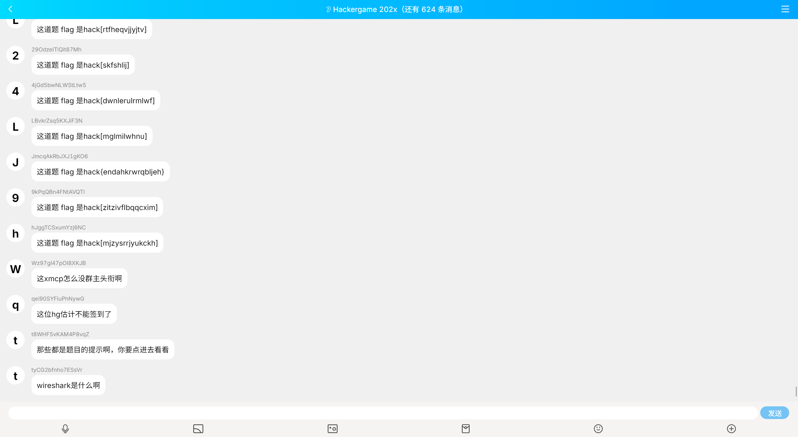

## 7. 组委会模拟器

每年比赛，组委会的一项重要工作就是时刻盯着群，并且撤回其中有 flag 的消息。今年因为人手紧张，组委会的某名同学将这项工作外包给了你，你需要连续审查 1000 条消息，准确无误地撤回其中所有含 flag 的消息，并且不撤回任何不含 flag 的消息。

本题中，你需要撤回的 "flag" 的格式为 `hack[...]`，其中**方括号**内均为小写英文字母，点击消息即可撤回。你需要在 3 秒内撤回消息，否则撤回操作将失败。在全部消息显示完成后等待几秒，如果你撤回的消息完全正确（撤回了全部需要撤回的消息，并且未将不需要撤回的消息撤回），就能获得本题**真正的 flag**。

### 题目描述

> 网址：http://202.38.93.111:10021/



这是一个模拟的 QQ 群聊天界面，点击消息即可撤回。

消息会越来越快，1000 条消息完成后，如果撤回准确无误，将会获得 flag。

### 尝试与解决

> 关键词：UserScript

这种手速游戏，最简单的处理方法就是浏览器脚本（UserScript）。具体细节不赘述。

```js
// ==UserScript==
// @name        HackerGame 2023 组委会模拟器
// @namespace   Violentmonkey Scripts
// @match       http://202.38.93.111:10021/*
// @grant       none
// @version     1.0
// @author      -
// @description 2023/10/28 13:37:36
// @require     https://cdn.jsdelivr.net/npm/jquery@3.6.4/dist/jquery.min.js
// ==/UserScript==

setInterval(() => {
  $('.fakeqq-message__bubble').each(function() {
    const text = $(this).text()
    if(/hack\[(.*?)\]/.test(text)) {
      $(this).click()
    }
  })
}, 50)
```

### Flag

```plain
flag{Web_pr0gra_mm1ng_907024aba2_15fun}
```

Web programming is fun!

### 其他做法

#### 自动化请求

通过自动化请求肯定也可以解决这个问题，但是相比于网页脚本，这实在过于麻烦了。
